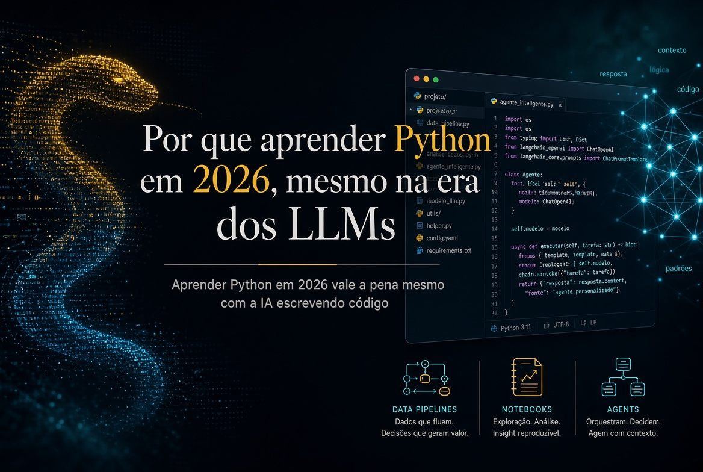

*Publicado em 9 de setembro de 2026, às 19:04, por Pedro Nakashima*



Se você é economista, advogado, contador, administrador, médico ou qualquer outra coisa que não seja programador, a pergunta que interessa não é se vale a pena **aprender Python** por diversão. É se ainda faz sentido investir algumas dezenas de horas nisso em 2026, num momento em que qualquer modelo de linguagem escreve código melhor do que a maioria dos iniciantes. Minha resposta é que faz, e por um motivo que quase ninguém explica direito: saber programar não compete com a inteligência artificial, ela **multiplica** o que você consegue fazer com ela. Este texto é sobre isso, e sobre o que a linguagem realmente permite construir.

## O que é Python, em duas frases

Python é uma linguagem de programação de uso geral, criada para ser lida com facilidade por gente e não apenas executada por máquina. Na prática, é a ferramenta com que você descreve, passo a passo, o que quer que o computador faça — abrir arquivos, calcular, consultar um sistema, gerar um relatório — e depois manda executar isso quantas vezes quiser, sempre igual.

Peço licença a quem já programa: os próximos parágrafos vão contar coisas que você sabe de cor. Vale a pena pular para a seção sobre a objeção dos LLMs.

A linguagem nasceu no fim dos anos 1980, quando **Guido van Rossum**, então no CWI (o instituto nacional holandês de pesquisa em matemática e computação, em Amsterdã), começou a escrevê-la como projeto de fim de ano. A primeira versão pública saiu em 1991. E o nome não veio da cobra: veio de *Monty Python's Flying Circus*, o programa de humor da BBC, de que Guido era fã — o que [a própria documentação oficial do Python confirma](https://docs.python.org/3/faq/general.html#why-is-it-called-python). A cobra apareceu depois, no logotipo, quando a piada já não era óbvia para todo mundo.

Isso não é curiosidade decorativa. Uma linguagem criada por alguém que se importava com humor e legibilidade acabou virando a linguagem em que o mundo faz ciência de dados — e essa não é uma coincidência tão grande quanto parece.

## `import this`: a linguagem tem uma declaração de princípios

Abra o Python e digite duas palavras:

```python
import this
```

O que aparece é isto:

```text
The Zen of Python, by Tim Peters

Beautiful is better than ugly.
Explicit is better than implicit.
Simple is better than complex.
Complex is better than complicated.
Flat is better than nested.
Sparse is better than dense.
Readability counts.
Special cases aren't special enough to break the rules.
Although practicality beats purity.
Errors should never pass silently.
Unless explicitly silenced.
In the face of ambiguity, refuse the temptation to guess.
There should be one-- and preferably only one --obvious way to do it.
Although that way may not be obvious at first unless you're Dutch.
Now is better than never.
Although never is often better than *right* now.
If the implementation is hard to explain, it's a bad idea.
If the implementation is easy to explain, it may be a good idea.
Namespaces are one honking great idea -- let's do more of those!
```

É uma piada escondida na linguagem, e ao mesmo tempo não é piada nenhuma. Esse texto é o **Zen of Python**, escrito por Tim Peters e registrado formalmente como [a PEP 20, uma das propostas oficiais de design da linguagem](https://peps.python.org/pep-0020/). Ele anuncia vinte aforismos, mas só dezenove foram escritos — a vigésima linha nunca existiu, e a brincadeira já dura décadas.

Três dessas linhas explicam por que a linguagem é boa para quem não é programador de carreira. "**Readability counts**" (legibilidade importa): o código é lido muitas vezes mais do que é escrito, e quem vai reler o seu script daqui a seis meses é você, sem lembrar de nada. "**Explicit is better than implicit**" (explícito é melhor que implícito): a linguagem prefere que você diga o que está fazendo a esconder mágica. E "**Errors should never pass silently**" (erros nunca deveriam passar em silêncio): quando algo dá errado, Python reclama alto, em vez de devolver um resultado errado com cara de certo — que é exatamente o pesadelo de quem trabalha com número.

A frase sobre ser holandês é uma piada com o próprio Guido. Mas o efeito prático de tudo isso é sério: um trecho de Python costuma ser legível mesmo para quem nunca programou. Veja este, que soma vendas por vendedor a partir de uma planilha:

```python
import pandas as pd

vendas = pd.read_excel("vendas.xlsx")
print(vendas.groupby("vendedor")["valor"].sum())
```

Quatro linhas. Você provavelmente entendeu o que elas fazem antes de eu explicar, e essa é a diferença entre uma linguagem que você aprende em fins de semana e uma que exige um semestre antes de produzir qualquer coisa útil.

## "Se a IA escreve o código, por que eu aprenderia?"

Esta é a objeção séria, e ela merece uma resposta séria em vez de um discurso motivacional. Vou dividi-la em três partes, porque são três problemas diferentes.

### Quem não lê código não sabe se o resultado está certo

Um modelo de linguagem escreve código plausível com muita facilidade. Plausível não é sinônimo de correto. Ele pode filtrar a coluna errada, tratar valores ausentes de um jeito que enviesa o resultado, converter data no formato americano quando a base está no brasileiro, ou aplicar uma taxa mensal onde a série é anual. Nada disso gera erro: gera um número.

Esse é o ponto que separa o usuário casual de quem trabalha com o resultado. Se o seu relatório vai para um cliente, para um juiz, para um conselho ou para um paciente, alguém precisa ser capaz de olhar as quinze linhas que produziram aquele número e dizer se elas fazem o que dizem fazer. Saber ler código é, hoje, uma forma de **controle de qualidade** — e é uma habilidade bem mais barata de adquirir do que saber escrever código do zero.

### Determinístico e probabilístico servem para coisas diferentes

Um modelo de linguagem é probabilístico: fazendo a mesma pergunta duas vezes, você pode receber respostas diferentes. Um programa é determinístico: com a mesma entrada, ele devolve exatamente a mesma saída, hoje e daqui a dois anos.

As duas propriedades são úteis, para coisas opostas. Você quer o modelo probabilístico para interpretar um texto ambíguo, resumir, classificar, extrair sentido. Você quer o programa determinístico para calcular juros, conferir totais, aplicar uma regra, validar um CPF, garantir que o mesmo processo rodou igual nos 4.000 documentos. Quem só tem uma das duas ferramentas acaba usando a errada — e usar modelo de linguagem para aritmética financeira é um jeito caro de descobrir isso.

### A IA fica muito mais forte na mão de quem programa

Aqui está o argumento que inverte a objeção. O uso realmente poderoso de LLM em 2026 não é conversar numa caixinha de texto: é **integrá-lo a um sistema**, e o sistema é escrito em Python.

Na prática, isso significa acessar modelos por API, ou rodá-los localmente com **Ollama** e modelos abertos do **Hugging Face** quando o dado é sigiloso e não pode sair da sua máquina. Significa transformar seus próprios documentos em **embeddings**, guardá-los num banco vetorial e montar um **RAG**, para que o modelo responda com base no seu acervo, e não no que ele acha que sabe. Significa usar **structured outputs** para receber um JSON com campos previsíveis em vez de um texto solto, dar **ferramentas** ao modelo com *tool calling*, e escrever **guardrails** — código determinístico que confere a resposta do modelo antes de ela virar decisão.

É por isso que a habilidade não está sendo substituída: ela mudou de posição. Python virou a **camada de orquestração** — quem chama o modelo, decide quando confiar nele, verifica o que ele devolveu e conecta o resultado ao resto do processo.

## O que dá para fazer

Vale mais mostrar do que argumentar. Estes são os cinco grandes blocos, e o interessante começa quando eles se juntam.

### Automação: o trabalho que ninguém deveria fazer duas vezes

É o primeiro retorno e o mais imediato. Renomear e organizar centenas de arquivos e pastas; consolidar dezenas de planilhas numa só; extrair páginas e dividir PDFs; gerar contratos ou relatórios a partir de um modelo; ler e disparar e-mails; baixar dados de um site que não oferece exportação (**web scraping**, com **Playwright** ou **Selenium** quando a página depende de navegador); consultar **APIs** de sistemas que você já usa.

Python é, nessa área, o que se costuma chamar de **linguagem de cola**: ela conversa com quase tudo, e por isso serve para amarrar sistemas que não foram feitos para se falar. Montado o script, ele vira rotina agendada, roda sozinho de madrugada, e o ganho não é só de tempo — é de **padronização**: o processo passa a acontecer do mesmo jeito toda vez, o que elimina a classe inteira de erro humano que aparece quando alguém repete a mesma tarefa chata pela quadragésima vez.

### Previsão: do palpite ao intervalo

Prever demanda, preço, receita, inadimplência, indicador econômico ou resultado esportivo é o mesmo tipo de problema com roupas diferentes. Python cobre desde o simples e sólido — **regressão**, suavização exponencial, **ARIMA** e **SARIMA**, modelos de espaço de estados, simulação de **Monte Carlo** — até aprendizado de máquina com **scikit-learn**, **XGBoost** e redes neurais, e modelos híbridos que combinam os dois mundos.

Mas o que separa previsão de chute não são os modelos, e sim a disciplina em volta deles: **validação temporal** (testar só com dados que existiam antes daquela data), **backtesting**, comparação automatizada entre alternativas e, sobretudo, **intervalos de previsão**. Um número sozinho é uma opinião com aparência de fato; um número com faixa de incerteza é uma previsão. Essa distinção é fácil de aplicar em código e quase impossível de manter na mão.

### Documentos e imagens: ler o que ninguém tem tempo de ler

Este é o bloco que mais interessa a quem trabalha com direito, contabilidade, saúde ou pesquisa. Dá para extrair texto e **tabelas** de PDFs, converter documentos em dados estruturados, processar DOCX, XLSX e HTML, e aplicar **OCR** em material escaneado — inclusive corrigindo rotação e melhorando a imagem antes, com **Pillow** ou **OpenCV**, o que costuma decidir se o reconhecimento presta ou não.

A partir daí vem a parte boa: reconhecer entidades (datas, valores, nomes, números de processo), classificar documentos por tipo, comparar duas versões de um contrato e apontar exatamente o que mudou, e indexar um acervo inteiro para busca semântica — perguntar "onde aparece cláusula de vencimento antecipado?" e receber as passagens, não uma lista de arquivos. Modelos multimodais fecham o ciclo, lendo o que está na imagem quando não há texto nenhum.

### Dashboards que você controla

Com **Streamlit**, **Dash**, **Panel** e **Plotly**, um painel interativo — com filtros, mapas, séries, previsão e intervalo de confiança — é código, não uma ferramenta separada. A diferença prática para as soluções de arrastar-e-soltar não é aparência: é que um dashboard em código é **versionável no Git**, reproduzível, atualizável sozinho e conectado direto ao banco ou à API que produz o dado. Ele complementa muito bem o Power BI, e às vezes o substitui.

### O encaixe: o pipeline

O ponto que amarra tudo é que essas peças moram na mesma linguagem, e por isso viram uma coisa só. Um fluxo realista hoje é assim: um script coleta os documentos e os dados de origem; extrai texto, tabelas e imagens; um modelo de previsão roda sobre a série resultante; um LLM classifica, resume e explica o que mudou; um conjunto de verificações determinísticas confere os números; e um dashboard apresenta o resultado, atualizado sem ninguém encostar. É o processo manual inteiro virando um pipeline reproduzível — e é isso que "saber Python" significa na prática, muito mais do que decorar sintaxe.

Se você quer ver por que insisto tanto nesse cruzamento entre áreas, escrevi sobre isso no [texto de abertura deste blog](/posts/economia-direito-codigo/index.qmd).

## Por onde começar, na prática

O erro clássico é começar por um curso de lógica de programação de quarenta horas e desistir na décima. O caminho que funciona é o contrário: escolher **uma tarefa chata e real** da sua semana e automatizá-la mal. Depois melhorar.

1. **Instale o essencial.** Baixe o Python em [python.org](https://www.python.org/) ou instale a distribuição Anaconda, que já vem com as bibliotecas de dados. Use o VS Code ou o Jupyter Notebook para escrever.
2. **Escolha o problema certo.** Não é "aprender Python": é "juntar as 30 planilhas que recebo por mês", "extrair as datas de vencimento desses 200 contratos", "baixar toda semana a série do indicador que eu acompanho". Tarefa pequena, repetitiva, sua.
3. **Escreva o primeiro script feio.** Ele vai ter nome de variável ruim e nenhum tratamento de erro. Não importa. Ele precisa funcionar uma vez.
4. **Use o LLM como monitor, não como oráculo.** Peça o código, e então peça para ele explicar linha por linha o que aquilo faz. A explicação é o curso; o código é só o resultado. É aqui que você aprende de verdade e rápido.
5. **Confira o resultado à mão, na primeira vez.** Rode o script e confira a saída contra o que você faria manualmente, num caso pequeno. Se bater, você acabou de ganhar um processo confiável. Se não bater, você acabou de aprender por quê.

Um exemplo do que cabe no passo 3 — padronizar o nome de todos os PDFs de uma pasta:

```python
from pathlib import Path

for arquivo in Path("contratos").glob("*.pdf"):
    novo_nome = arquivo.name.replace(" ", "-").lower()
    arquivo.rename(arquivo.with_name(novo_nome))
```

São três linhas úteis, e elas fazem em um segundo o que levaria uma tarde. O primeiro script que resolve um problema seu é o momento em que a curva de aprendizado deixa de ser esforço e passa a ser retorno. A [documentação oficial da linguagem](https://docs.python.org/3/tutorial/) é gratuita, boa e mais didática do que a fama sugere.

## Perguntas frequentes

### Preciso saber matemática para aprender Python?

Para automação, processamento de documentos e dashboards, não — basta a matemática que você já usa no trabalho. Para modelagem estatística e previsão, você precisa entender os conceitos (o que é um resíduo, o que significa um intervalo de confiança), mas não precisa deduzir as fórmulas: as bibliotecas fazem o cálculo. Entender o que o modelo assume é mais importante do que saber implementá-lo.

### Quanto tempo leva até ser útil?

Depende do que você chama de útil. Para automatizar uma tarefa repetitiva simples, é razoável esperar algumas semanas de uso intermitente. Para análise de dados com autonomia, alguns meses. Isso, hoje, com um LLM ao lado explicando cada linha, é bem mais rápido do que era há cinco anos — e é outro motivo pelo qual a era dos modelos é um bom momento para começar, não um mau.

### Python ou Excel?

Não é uma escolha. O Excel continua imbatível para explorar um conjunto pequeno de dados e mostrar algo rapidamente a alguém. Python entra quando o volume passa do que a planilha aguenta, quando a tarefa se repete todo mês, quando o processo precisa ser auditável, ou quando você precisa registrar exatamente o que foi feito para outra pessoa reproduzir. Na maior parte das rotinas profissionais, os dois convivem: Python processa, o Excel apresenta.

### E se eu aprender e a IA tornar isso obsoleto em dois anos?

É uma preocupação legítima, e não tenho certeza absoluta sobre o futuro. O que observo é que cada avanço recente aumentou, e não diminuiu, o valor de entender o que o código faz: alguém precisa especificar o problema, escolher os dados, avaliar a saída e responder pelo resultado. O que muda é a proporção entre digitar e julgar. A parte que está sendo automatizada é justamente a que menos exigia de você.

## Conclusão

- **Aprender Python em 2026 ainda compensa**, e o principal motivo mudou: não é escrever código mais rápido, é conseguir avaliar, verificar e orquestrar o que a IA produz.
- Modelos de linguagem são probabilísticos e **programas são determinísticos** — usar cada um no lugar certo é a habilidade que separa resultado de acidente.
- A sintaxe legível não é detalhe estético: ela é o que torna a linguagem viável para quem não vai programar em tempo integral, e o `import this` mostra que isso foi decisão de projeto, não sorte.
- O retorno prático aparece em cinco frentes — **automação, previsão, documentos e imagens, LLMs integrados e dashboards** — e a força real está em juntá-las num único pipeline.
- Comece por uma tarefa chata e real da sua semana, escreva o primeiro script feio e use o LLM para explicar cada linha em vez de apenas entregá-las prontas.

---

**Tópicos:** #Python #Programacao #InteligenciaArtificial #Automacao #CienciaDeDados

<script type="application/ld+json">
{
  "@context": "https://schema.org",
  "@type": "BlogPosting",
  "headline": "Por que aprender Python em 2026, mesmo na era dos LLMs",
  "description": "Aprender Python em 2026 vale a pena mesmo com a IA escrevendo código: o que a linguagem faz, por que ela potencializa quem usa LLMs e por onde começar hoje.",
  "inLanguage": "pt-BR",
  "datePublished": "2026-09-09T19:04:10-04:00",
  "dateModified": "2026-09-09T19:04:10-04:00",
  "author": { "@type": "Person", "name": "Pedro Nakashima" },
  "mainEntityOfPage": "https://pedronakashima.com/posts/aprender-python-2026/",
  "keywords": "aprender Python, Python 2026, automação com Python, LLM, ciência de dados, dashboards, processamento de documentos"
}
</script>
