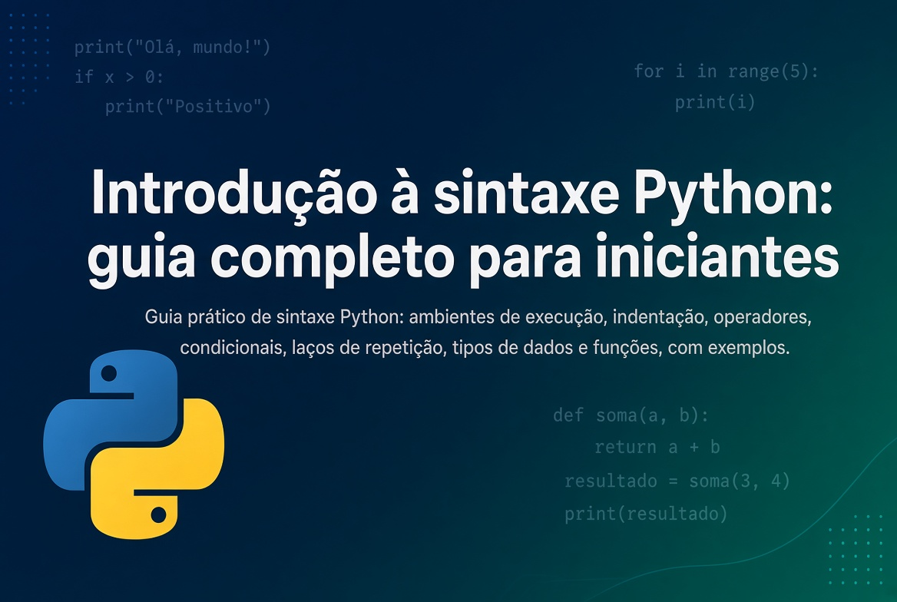

*Publicado em 10 de setembro de 2026, às 07:30, por Pedro Nakashima*



Este é o guia prático que faltava no [texto anterior sobre por que vale a pena aprender Python em 2026](/posts/aprender-python-2026/index.qmd): ali ficou a motivação, aqui fica a sintaxe Python que você de fato escreve todos os dias. Nas próximas seções você vai ver onde rodar seu primeiro código, como a indentação organiza um programa Python, os principais tipos de dados, os operadores matemáticos e de comparação, como escrever condicionais e laços de repetição, o que a função `range()` faz e como definir e chamar uma função. Nenhum desses elementos foi tratado no texto anterior — aqui é onde a sintaxe entra, peça por peça, com exemplos que rodam de verdade.

## Onde escrever e rodar seu código Python

Antes de decorar comando nenhum, você precisa de um lugar para digitá-lo e ver o resultado aparecer. As quatro opções mais comuns cobrem praticamente todo mundo, e a escolha certa depende menos de gosto e mais do que você vai fazer.

### Jupyter Notebook, via Anaconda

O Jupyter Notebook organiza o código em **células**: você escreve um pedaço, roda só aquele pedaço com `Shift+Enter` e vê o resultado logo abaixo, sem reexecutar o script inteiro. É o formato dominante para explorar dados, porque mistura código, texto explicativo, tabelas e gráficos no mesmo documento. A forma mais simples de ter isso instalado é a distribuição **Anaconda**, que já traz o Jupyter e as bibliotecas de dados mais usadas (pandas, numpy, matplotlib) prontas, sem instalação separada de cada uma.

### Google Colab

O **Google Colab** é um Jupyter Notebook que roda inteiro no navegador, hospedado pelo Google — sem instalar nada na sua máquina, com acesso gratuito a GPU para quem for treinar modelos mais pesados. É o ponto de partida mais rápido possível: basta abrir o [Google Colab](https://colab.research.google.com/) numa conta Google e já há um notebook em branco pronto para receber código. A desvantagem é a dependência de internet e o fato de o ambiente resetar entre sessões, o que o torna ótimo para aprender e testar, mas não para um projeto que precisa de arquivos locais permanentes.

### VS Code

O **VS Code** é um editor de código de uso geral, não um notebook: você abre uma pasta de projeto, escreve arquivos `.py`, roda scripts inteiros pelo terminal integrado e versiona tudo com Git, sem sair do editor. Com a extensão oficial de Python instalada, ele também abre notebooks Jupyter dentro da própria janela — então não é uma escolha excludente com o item anterior, é o degrau seguinte, para quando o código deixa de ser um experimento e vira um programa organizado em vários arquivos.

### Outros IDEs

Duas alternativas valem menção. O **PyCharm** é um IDE dedicado a Python, com refatoração de código e depuração mais robustas, usado sobretudo em projetos de software maiores. O **Spyder** já vem junto da distribuição Anaconda e imita a divisão de painéis do RStudio (editor, console, variáveis), o que agrada quem vem da estatística. Nenhum dos dois é necessário para começar — mas é bom saber que existem quando o projeto crescer.

Resumindo a escolha:

- **Quer testar um trecho de código agora, sem instalar nada**: Google Colab.
- **Vai explorar uma base de dados, com gráficos e texto juntos**: Jupyter Notebook (Anaconda).
- **Vai escrever um script ou projeto com vários arquivos**: VS Code.
- **Projeto científico grande, com preferência por painéis fixos**: Spyder ou PyCharm.

## O papel da indentação

Aqui está a diferença mais visível entre Python e a maioria das outras linguagens: **não existem chaves `{ }` para marcar onde um bloco de código começa e termina** — quem marca é a indentação, isto é, os espaços no início da linha. Um bloco pertence ao comando anterior enquanto continuar recuado; a primeira linha que voltar para a margem esquerda encerra o bloco.

```python
idade = 20

if idade >= 18:
    print("maior de idade")
    print("pode dirigir")
else:
    print("menor de idade")
```

As duas linhas depois do `if` estão recuadas quatro espaços e por isso pertencem a ele; a linha do `else` volta para a margem e abre um novo bloco. A convenção oficial, registrada na [PEP 8, o guia de estilo da linguagem](https://peps.python.org/pep-0008/), é **quatro espaços por nível**, nunca tabulação — misturar os dois no mesmo bloco gera `TabError` e o programa nem chega a rodar. Todo editor citado na seção anterior já vem configurado para inserir quatro espaços sozinho quando você aperta Tab, então na prática isso raramente exige atenção manual; o que importa é entender que a indentação **não é estética**, é a própria sintaxe que decide o que está dentro e o que está fora de cada bloco.

## Tipos de dados básicos

Toda informação em Python tem um tipo, e a linguagem descobre esse tipo sozinha a partir do valor — você nunca declara `int x` como em outras linguagens. Os tipos que aparecem o tempo todo são:

| Tipo | O que guarda | Exemplo |
|---|---|---|
| `int` | número inteiro | `idade = 32` |
| `float` | número com casas decimais | `preco = 19.90` |
| `str` | texto, entre aspas | `nome = "Ana"` |
| `bool` | verdadeiro ou falso | `ativo = True` |
| `list` | uma sequência editável de itens | `notas = [7.5, 8.0, 6.5]` |
| `dict` | pares de chave e valor | `pessoa = {"nome": "Ana", "idade": 32}` |

A função embutida `type()` revela o tipo de qualquer valor, o que ajuda bastante quando um erro aparece e não está claro por quê:

```python
print(type(32))        # <class 'int'>
print(type(19.90))     # <class 'float'>
print(type("Ana"))     # <class 'str'>
```

Vale registrar duas variações que aparecem com frequência assim que você sai do básico: a `tuple` (uma lista que não pode mais ser alterada depois de criada, escrita entre parênteses) e o `set` (uma coleção sem ordem e sem repetição, escrita entre chaves). Nenhuma das duas é essencial no primeiro contato — mas reconhecer o nome ajuda a não estranhar quando aparecer num exemplo.

## Operadores matemáticos

Além dos quatro óbvios, Python tem dois operadores que confundem quem vem de outra linguagem: a **divisão inteira** (`//`) e a **exponenciação** (`**`).

| Operador | Operação | Exemplo | Resultado |
|---|---|---|---|
| `+` | soma | `7 + 3` | `10` |
| `-` | subtração | `7 - 3` | `4` |
| `*` | multiplicação | `7 * 3` | `21` |
| `/` | divisão | `7 / 3` | `2.3333...` |
| `//` | divisão inteira | `7 // 3` | `2` |
| `%` | resto da divisão (módulo) | `7 % 3` | `1` |
| `**` | potenciação | `7 ** 2` | `49` |

O módulo (`%`) é mais útil do que parece: é ele que responde "esse número é par?" (`n % 2 == 0`) sem precisar de nenhuma outra função, e é a base de qualquer código que precisa repetir um padrão a cada N itens.

## Operadores de comparação

Comparar dois valores sempre devolve um `bool` — `True` ou `False` — e é esse resultado que alimenta os condicionais da próxima seção.

| Operador | Significado | Exemplo | Resultado |
|---|---|---|---|
| `==` | igual a | `5 == 5` | `True` |
| `!=` | diferente de | `5 != 3` | `True` |
| `>` | maior que | `5 > 3` | `True` |
| `<` | menor que | `5 < 3` | `False` |
| `>=` | maior ou igual a | `5 >= 5` | `True` |
| `<=` | menor ou igual a | `5 <= 3` | `False` |

Um detalhe que Python tem e a maioria das linguagens não tem: dá para **encadear comparações** numa única expressão, do jeito que se escreve na matemática. `0 <= nota <= 10` testa se `nota` está entre 0 e 10 de uma vez, sem precisar escrever `nota >= 0 and nota <= 10`.

## Condicionais: if, elif e else

O condicional decide qual bloco de código roda, de acordo com o resultado de uma comparação. `if` testa a primeira condição; `elif` (contração de "else if") testa outra, só se a anterior for falsa; `else` roda quando nenhuma das anteriores foi verdadeira.

```python
nota = 7.5

if nota >= 9:
    conceito = "A"
elif nota >= 7:
    conceito = "B"
elif nota >= 5:
    conceito = "C"
else:
    conceito = "D"

print(conceito)  # B
```

Cada `elif` só é avaliado se todos os testes acima dele falharam, e o Python para no primeiro bloco verdadeiro — por isso a ordem das condições importa: se a primeira linha fosse `nota >= 5`, o exemplo acima nunca chegaria a checar `nota >= 7` ou `nota >= 9`.

## Laços de repetição: for e while

Python tem dois laços, e a diferença entre eles não é de sintaxe, é de propósito. O `for` percorre uma sequência já conhecida — uma lista, um texto, um intervalo de números — item por item, e termina sozinho quando a sequência acaba.

```python
notas = [7.5, 8.0, 6.5, 9.0]

for nota in notas:
    print(nota)
```

O `while` repete enquanto uma condição continuar verdadeira, sem saber de antemão quantas vezes isso vai acontecer — por isso é o laço certo para "repita até o usuário digitar sair" ou "repita até o erro ficar pequeno o bastante".

```python
tentativas = 0

while tentativas < 3:
    print("tentativa", tentativas)
    tentativas = tentativas + 1
```

Dentro de qualquer um dos dois, `break` interrompe o laço na hora, e `continue` pula direto para a próxima repetição sem executar o resto do bloco daquela vez. A [documentação oficial do Python sobre laços e condicionais](https://docs.python.org/3/tutorial/controlflow.html) detalha as variações mais avançadas, para quando o básico não bastar mais.

## A função range()

`range()` gera uma sequência de números inteiros, e é o parceiro mais comum do `for` quando você quer repetir algo um número certo de vezes, em vez de percorrer uma lista já pronta.

```python
for n in range(5):
    print(n)
# 0, 1, 2, 3, 4
```

Com um segundo argumento, `range(inicio, fim)` começa em `inicio` e vai até `fim - 1` — o limite final nunca é incluído, o que costuma pegar quem está começando de surpresa:

```python
for n in range(1, 11):
    print(n)
# 1, 2, 3, 4, 5, 6, 7, 8, 9, 10
```

Um terceiro argumento define o passo: `range(0, 10, 2)` produz `0, 2, 4, 6, 8`, pulando de dois em dois. Vale um esclarecimento técnico: `range()` não cria uma lista na memória — ele devolve um objeto que gera cada número sob demanda, o que faz `range(1_000_000)` custar praticamente nada, mesmo cobrindo um milhão de números. Quando você precisa mesmo de uma lista de verdade, converte com `list(range(5))`.

## Introdução a funções: definição e chamada

Uma função empacota um pedaço de código com nome, para não reescrevê-lo toda vez que precisar dele de novo. Você **define** a função uma vez, com `def`, e **chama** ela quantas vezes quiser depois.

```python
def saudacao(nome):
    return f"Olá, {nome}!"

print(saudacao("Maria"))
print(saudacao("Carlos"))
```

`def saudacao(nome):` é a definição: o nome da função, entre parênteses o **parâmetro** que ela espera receber, e o bloco indentado abaixo é o que ela faz. `return` devolve um valor para quem chamou a função — sem ele, a função roda mas não entrega nada de volta. `saudacao("Maria")` é a **chamada**: o parêntese com um valor de verdade dentro (o **argumento**) dispara a execução do bloco definido antes.

Parâmetros podem ter um valor padrão, usado quando quem chama não informa nada naquela posição:

```python
def saudacao(nome, cumprimento="Olá"):
    return f"{cumprimento}, {nome}!"

print(saudacao("Maria"))              # Olá, Maria!
print(saudacao("Carlos", "Bom dia"))  # Bom dia, Carlos!
```

Esse é o mesmo mecanismo por trás de toda função pronta que você já usa sem perceber — `print()`, `range()`, `type()` — e é exatamente o que faz uma biblioteca como o pandas funcionar: `pd.read_excel("vendas.xlsx")` é uma chamada de função, só que definida por outra pessoa.

## Perguntas frequentes

### Preciso escolher entre Jupyter, Colab e VS Code, ou posso usar mais de um?

Pode, e a maioria de quem programa usa mais de um mesmo: Colab ou Jupyter para explorar uma base de dados e testar ideias rápido, VS Code quando o código vira um script ou projeto com vários arquivos que precisa de Git e de organização.

### Por que Python usa indentação em vez de chaves, como outras linguagens?

Foi uma decisão de design da linguagem, não uma limitação técnica: ao obrigar que a estrutura visual do código coincida com a estrutura lógica dele, Python torna impossível escrever um bloco que "parece" pertencer a um `if` mas na verdade pertence a outro — um erro comum em linguagens que usam chaves e permitem indentação livre.

### Qual a diferença prática entre for e while?

Use `for` quando você já sabe sobre o que está iterando — uma lista, um intervalo de `range()`, os caracteres de um texto. Use `while` quando o número de repetições depende de uma condição que só se resolve durante a execução, como esperar o usuário digitar um valor válido.

### range() devolve mesmo uma lista de números?

Não — devolve um objeto do tipo `range`, que gera os números sob demanda em vez de guardá-los todos na memória de uma vez. Para a maioria dos usos dentro de um `for` isso é transparente; só importa converter para `list()` quando você precisar manipular os números como uma lista de verdade.

### Preciso declarar o tipo de retorno de uma função?

Não. Python descobre o tipo de qualquer valor sozinho, inclusive o que uma função devolve — é o que se chama de tipagem dinâmica. Dá para anotar o tipo esperado (`def saudacao(nome: str) -> str:`) como documentação para quem lê o código, mas isso não é obrigatório e o interpretador não impede um tipo diferente do anotado.

## Conclusão

- **Escolha o ambiente pelo que você vai fazer**: Google Colab para começar sem instalar nada, Jupyter Notebook (via Anaconda) para explorar dados, VS Code para scripts e projetos com vários arquivos.
- **A indentação não é estilo, é sintaxe**: quatro espaços por nível, nunca tabulação, é o que delimita cada bloco de código em Python.
- Os **tipos de dados básicos** — `int`, `float`, `str`, `bool`, `list` e `dict` — cobrem a grande maioria do que você vai manipular no início.
- Os **operadores matemáticos** (`+ - * / // % **`) e os **de comparação** (`== != > < >= <=`) são a base de qualquer condicional ou laço.
- **`if`/`elif`/`else`** decidem qual bloco roda; **`for`** percorre uma sequência conhecida, **`while`** repete enquanto uma condição for verdadeira; **`range()`** gera a sequência de números mais usada dentro de um `for`.
- **Funções** (`def` para definir, chamada com parênteses para executar) são o jeito de empacotar código para reutilizar — e é o mesmo mecanismo por trás de toda função pronta de biblioteca que você já usa.

---

**Tópicos:** #Python #Programacao #Tutorial #SintaxePython

<script type="application/ld+json">
{
  "@context": "https://schema.org",
  "@type": "BlogPosting",
  "headline": "Introdução à sintaxe Python: guia completo para iniciantes",
  "description": "Guia prático de sintaxe Python: ambientes de execução, indentação, operadores, condicionais, laços de repetição, tipos de dados e funções, com exemplos.",
  "inLanguage": "pt-BR",
  "datePublished": "2026-09-10T07:30:28-03:00",
  "dateModified": "2026-09-10T07:30:28-03:00",
  "author": { "@type": "Person", "name": "Pedro Nakashima" },
  "mainEntityOfPage": "https://pedronakashima.com/posts/introducao-sintaxe-python/",
  "keywords": "python, programação, sintaxe, tutorial, sintaxe Python, operadores Python, condicionais, laços de repetição, range(), tipos de dados, funções Python, Jupyter Notebook"
}
</script>
