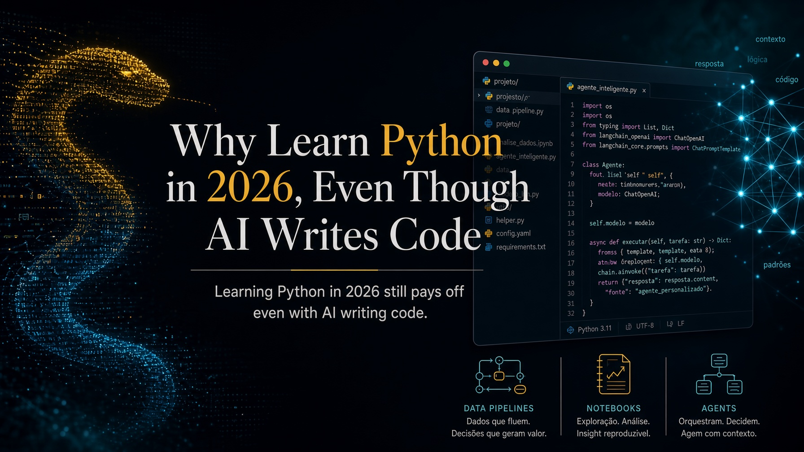

*Published on September 9, 2026 at 7:19 PM by Pedro Nakashima*



If you are an economist, a lawyer, an accountant, a physician, or anything else that is not a software developer, the question worth asking is not whether it would be fun to **learn Python**. It is whether it still makes sense to put a few dozen hours into it in 2026, at a moment when any language model writes better code than most beginners. My answer is that it does, for a reason almost nobody explains properly: knowing how to program does not compete with artificial intelligence. It **multiplies** what you can do with it. This post is about that, and about what the language actually lets you build.

## What Python is, in two sentences

Python is a general-purpose programming language, designed to be read easily by people and not merely executed by machines. In practice, it is the tool you use to describe, step by step, what you want the computer to do — open files, calculate, query a system, produce a report — and then run that as many times as you like, identically every time.

To anyone who already codes: the next few paragraphs will tell you things you know by heart. Feel free to skip ahead to the section on the LLM objection.

The language was born in the late 1980s, when **Guido van Rossum**, then at CWI (the Dutch national research institute for mathematics and computer science, in Amsterdam), started writing it as a holiday project. The first public release came in 1991. And the name did not come from the snake: it came from *Monty Python's Flying Circus*, the BBC comedy series Guido was a fan of, as [the official Python documentation confirms](https://docs.python.org/3/faq/general.html#why-is-it-called-python). The snake showed up later, in the logo, once the joke was no longer obvious to everyone.

This is not decorative trivia. A language created by someone who cared about humor and readability ended up becoming the language the world does data science in — and that is less of a coincidence than it looks.

## `import this`: the language ships with a statement of principles

Open Python and type two words:

```python
import this
```

Here is what appears:

```text
The Zen of Python, by Tim Peters

Beautiful is better than ugly.
Explicit is better than implicit.
Simple is better than complex.
Complex is better than complicated.
Flat is better than nested.
Sparse is better than dense.
Readability counts.
Special cases aren't special enough to break the rules.
Although practicality beats purity.
Errors should never pass silently.
Unless explicitly silenced.
In the face of ambiguity, refuse the temptation to guess.
There should be one-- and preferably only one --obvious way to do it.
Although that way may not be obvious at first unless you're Dutch.
Now is better than never.
Although never is often better than *right* now.
If the implementation is hard to explain, it's a bad idea.
If the implementation is easy to explain, it may be a good idea.
Namespaces are one honking great idea -- let's do more of those!
```

It is a joke hidden inside the language, and at the same time it is not a joke at all. This text is the **Zen of Python**, written by Tim Peters and formally recorded as [PEP 20, one of the language's official design proposals](https://peps.python.org/pep-0020/). It announces twenty aphorisms, but only nineteen were ever written down — the twentieth line has never existed, and the running gag is now decades old.

Three of those lines explain why the language works so well for people who are not career programmers. **"Readability counts"**: code is read far more often than it is written, and the person rereading your script six months from now is you, remembering nothing. **"Explicit is better than implicit"**: the language would rather you say what you are doing than hide it behind magic. And **"Errors should never pass silently"**: when something goes wrong, Python complains loudly instead of handing back a wrong result wearing the face of a right one — which is precisely the nightmare of anyone who works with numbers.

The line about being Dutch is a joke at Guido's own expense. But the practical effect of all this is serious: a piece of Python tends to be legible even to someone who has never programmed. Look at this one, which totals sales by representative from a spreadsheet:

```python
import pandas as pd

sales = pd.read_excel("sales.xlsx")
print(sales.groupby("rep")["amount"].sum())
```

Four lines. You probably understood what they do before I explained, and that is the difference between a language you pick up over a few weekends and one that demands a semester before it produces anything useful.

## "If AI writes the code, why would I learn?"

This is the serious objection, and it deserves a serious answer rather than a motivational speech. I will split it into three parts, because they are three different problems.

### If you cannot read code, you cannot tell whether the result is right

A language model produces plausible code very easily. Plausible is not a synonym for correct. It can filter the wrong column, handle missing values in a way that biases the result, read dates as MM/DD when the source is DD/MM, or apply a monthly rate to an annual series. None of that raises an error. It produces a number.

That is the point separating the casual user from someone who has to stand behind the output. If your report goes to a client, a judge, a board, or a patient, somebody needs to be able to look at the fifteen lines that produced that number and say whether they do what they claim to do. Reading code has become a form of **quality control** — and it is a far cheaper skill to acquire than writing code from scratch.

### Deterministic and probabilistic are good at different things

A language model is probabilistic: ask the same question twice and you may get different answers. A program is deterministic: given the same input, it returns exactly the same output, today and two years from now.

Both properties are useful, for opposite purposes. You want the probabilistic tool to interpret ambiguous text, summarize, classify, extract meaning. You want the deterministic one to compute interest, reconcile totals, apply a rule, validate an identifier, and guarantee that the same process ran identically across all 4,000 documents. Anyone holding only one of the two ends up using the wrong one — and using a language model for financial arithmetic is an expensive way to discover this.

### AI gets far more powerful in the hands of someone who programs

Here is the argument that turns the objection inside out. The genuinely powerful use of an LLM in 2026 is not chatting in a text box: it is **wiring the model into a system**, and the system is written in Python.

In practice that means reaching models through APIs, or running them locally with **Ollama** and open models from **Hugging Face** when the data is confidential and cannot leave your machine. It means turning your own documents into **embeddings**, storing them in a vector database and assembling a **RAG** setup, so the model answers from your corpus rather than from what it thinks it knows. It means using **structured outputs** to get JSON with predictable fields instead of loose prose, handing the model **tools** through function calling, and writing **guardrails** — deterministic code that checks the model's answer before it turns into a decision.

That is why the skill is not being replaced: it moved. Python became the **orchestration layer** — the thing that calls the model, decides when to trust it, verifies what came back, and connects the result to the rest of the process.

## What you can actually build

Showing beats arguing. These are the five big blocks, and the interesting part starts when they come together.

### Automation: the work nobody should do twice

This is the first payoff and the most immediate one. Renaming and organizing hundreds of files and folders; consolidating dozens of spreadsheets into one; splitting PDFs and pulling out pages; generating contracts or reports from a template; reading and sending email; pulling data from a site that offers no export (**web scraping**, with **Playwright** or **Selenium** when the page needs a real browser); querying the **APIs** of systems you already pay for.

In this area Python is what people call a **glue language**: it talks to almost everything, which makes it the right tool for tying together systems that were never designed to speak to each other. Once the script exists, it becomes a scheduled job, runs by itself overnight, and the gain is not only time — it is **standardization**: the process now happens the same way every time, which eliminates the entire class of human error that shows up when someone repeats the same dull task for the fortieth time.

### Forecasting: from a guess to an interval

Forecasting demand, prices, revenue, defaults, an economic indicator, or a sports result is the same kind of problem wearing different clothes. Python covers everything from the simple and sturdy — **regression**, exponential smoothing, **ARIMA** and **SARIMA**, state space models, **Monte Carlo** simulation — through machine learning with **scikit-learn**, **XGBoost**, and neural networks, and hybrid models that combine both worlds.

But what separates forecasting from guessing is not the models; it is the discipline around them: **temporal validation** (testing only against data that existed before that date), **backtesting**, automated comparison between alternatives, and above all **prediction intervals**. A lone number is an opinion wearing the costume of a fact; a number with a band of uncertainty is a forecast. That distinction is easy to enforce in code and nearly impossible to maintain by hand.

### Documents and images: reading what nobody has time to read

This is the block that matters most to people in law, accounting, healthcare, and research. You can extract text and **tables** from PDFs, turn documents into structured data, process DOCX, XLSX and HTML, and run **OCR** over scanned material — including straightening the page and cleaning up the image first with **Pillow** or **OpenCV**, which usually decides whether the recognition is any good.

From there comes the good part: recognizing entities (dates, amounts, names, case numbers), classifying documents by type, comparing two versions of a contract and pointing to exactly what changed, and indexing an entire archive for semantic search — asking "where does an acceleration clause appear?" and getting the passages back, not a list of filenames. Multimodal models close the loop, reading what is in the image when there is no text at all.

### Dashboards you control

With **Streamlit**, **Dash**, **Panel**, and **Plotly**, an interactive dashboard — filters, maps, time series, forecasts, confidence bands — is code, not a separate product. The practical difference from drag-and-drop tools is not looks: a dashboard written in code is **versioned in Git**, reproducible, self-updating, and connected straight to the database or API that produces the data. It complements Power BI very well, and sometimes replaces it.

### The payoff: the pipeline

What ties everything together is that these pieces live in the same language, and so they become one thing. A realistic flow today looks like this: a script collects the source documents and data; text, tables, and images get extracted; a forecasting model runs over the resulting series; an LLM classifies, summarizes, and explains what changed; a set of deterministic checks verifies the numbers; and a dashboard presents the result, refreshed without anyone touching it. That is an entire manual process becoming a reproducible pipeline — and that, far more than memorizing syntax, is what "knowing Python" means in practice.

If you want to see why I keep insisting on this crossing between fields, I wrote about it in [this blog's opening post](/posts/economics-law-code/index.qmd).

## Where to start, practically

The classic mistake is beginning with a forty-hour course on programming logic and quitting at hour ten. The path that works runs the other way: pick **one dull, real task** from your week and automate it badly. Then improve it.

1. **Install the essentials.** Get Python from [python.org](https://www.python.org/), or install the Anaconda distribution, which already ships with the data libraries. Write in VS Code or a Jupyter Notebook.
2. **Pick the right problem.** It is not "learn Python": it is "merge the 30 spreadsheets I get every month", "pull the due dates out of these 200 contracts", "download the indicator I track every week". Small, repetitive, yours.
3. **Write the first ugly script.** It will have bad variable names and no error handling. That is fine. It only has to work once.
4. **Use the LLM as a tutor, not an oracle.** Ask for the code, then ask it to explain the code line by line. The explanation is the course; the code is just the output. This is where you actually learn, and fast.
5. **Check the result by hand the first time.** Run the script and compare its output against what you would have done manually, on a small case. If it matches, you just gained a process you can trust. If it does not, you just learned why.

Here is what fits in step 3 — standardizing the filename of every PDF in a folder:

```python
from pathlib import Path

for file in Path("contracts").glob("*.pdf"):
    new_name = file.name.replace(" ", "-").lower()
    file.rename(file.with_name(new_name))
```

Three useful lines, doing in one second what would take an afternoon. The first script that solves a problem of your own is the moment the learning curve stops being effort and starts being return. [The official language tutorial](https://docs.python.org/3/tutorial/) is free, good, and friendlier than its reputation suggests.

## FAQ

### Do I need math to learn Python?

For automation, document processing, and dashboards, no — the math you already use at work is enough. For statistical modeling and forecasting you need to understand the concepts (what a residual is, what a confidence interval means), but you do not need to derive the formulas: the libraries do the computing. Understanding what a model assumes matters far more than being able to implement it.

### How long until it is useful?

It depends on what you call useful. To automate one simple repetitive task, a few weeks of intermittent use is reasonable. For independent data analysis, a few months. With an LLM beside you explaining every line, that is considerably faster than it was five years ago — which is another reason the age of the models is a good moment to begin, not a bad one.

### Python or Excel?

It is not a choice. Excel remains unbeatable for exploring a small dataset and showing someone something quickly. Python takes over when the volume exceeds what a spreadsheet can hold, when the task repeats every month, when the process has to be auditable, or when you need an exact record of what was done so someone else can reproduce it. In most professional routines the two coexist: Python processes, Excel presents.

### What if I learn this and AI makes it obsolete in two years?

It is a fair concern, and I have no certainty about the future. What I observe is that every recent advance has increased, not decreased, the value of understanding what code does: someone still has to frame the problem, choose the data, judge the output, and answer for the result. What changes is the ratio between typing and judging. The part being automated is precisely the part that asked the least of you.

## Conclusion

- **Learning Python in 2026 still pays off**, and the main reason has changed: it is no longer about writing code faster, it is about being able to judge, verify, and orchestrate what the AI produces.
- Language models are probabilistic and **programs are deterministic** — using each in the right place is the skill that separates a result from an accident.
- Readable syntax is not an aesthetic detail: it is what makes the language viable for people who will never program full-time, and `import this` shows that this was a design decision, not luck.
- The practical return shows up across five fronts — **automation, forecasting, documents and images, integrated LLMs, and dashboards** — and the real power is in joining them into a single pipeline.
- Start with one dull, real task from your week, write the first ugly script, and use the LLM to explain each line rather than merely hand them over.

---

**Topics:** #Python #Programming #ArtificialIntelligence #Automation #DataScience

<script type="application/ld+json">
{
  "@context": "https://schema.org",
  "@type": "BlogPosting",
  "headline": "Why Learn Python in 2026, Even Though AI Writes Code",
  "description": "Learning Python in 2026 still pays off even with AI writing code: what the language actually does, why it makes LLM users stronger, and where to start today.",
  "inLanguage": "en-US",
  "datePublished": "2026-09-09T19:19:36-04:00",
  "dateModified": "2026-09-09T19:19:36-04:00",
  "author": { "@type": "Person", "name": "Pedro Nakashima" },
  "mainEntityOfPage": "https://pedronakashima.com/posts/learn-python-2026/",
  "keywords": "learn Python, Python 2026, Python automation, LLM, data science, dashboards, document processing"
}
</script>
