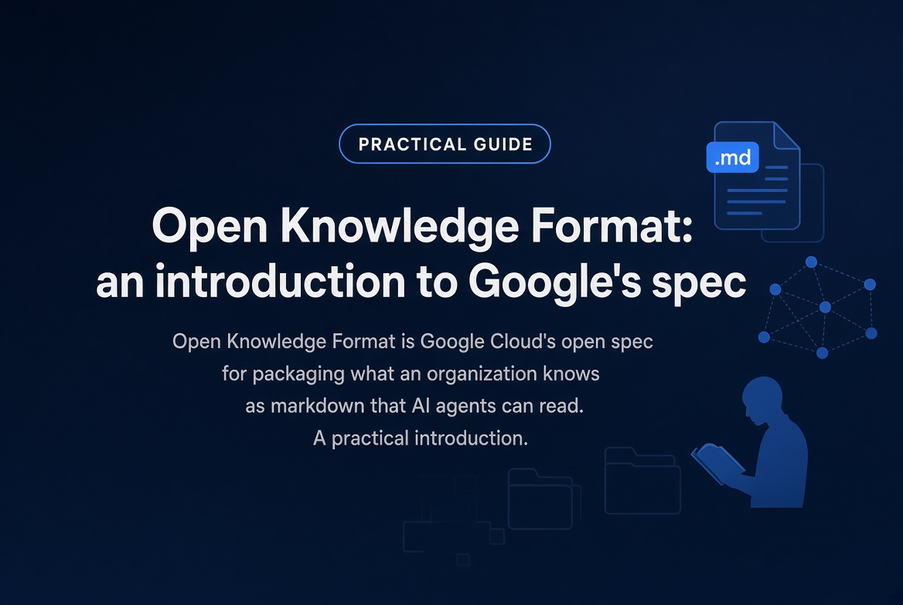

*Published on September 12, 2026 at 7:19 PM by Pedro Nakashima*



The Open Knowledge Format (OKF) is an open specification from Google Cloud, published in June 2026, for writing down what an organization knows — its tables, metrics, APIs and operational runbooks — in a form that humans and AI agents read equally well. The short answer to what it is underneath: a folder of markdown files, each one carrying a YAML metadata block at the top. There is no new database, no binary format, no mandatory SDK and no central authority. If that sounds too plain to be called a specification, you have understood the thesis: in OKF, plainness is the feature, not the shortcoming. This article introduces the format to readers who have never come across it, walks through a complete concept file, and is candid about what OKF does not yet solve.

A note before we start: I have written a full guide to markdown syntax on this blog, but it exists **in Portuguese only** — if you read it, [introdução à sintaxe markdown](/posts/introducao-sintaxe-markdown/index.qmd) covers the ground this article assumes. Everything here takes for granted that you already know what a `##`, a fenced code block and a link are. What matters below is not how to write markdown. It is what happens when someone decides that a folder of `.md` files is the right way to hand knowledge to a machine.

## What the Open Knowledge Format is

The Open Knowledge Format is a specification that defines how to package knowledge as a directory of markdown files with YAML frontmatter, cross-linked so that an AI agent can traverse them. Each file represents **one concept**: a table, a metric, a dataset, a runbook, an endpoint. A directory of those files is what the spec calls a **bundle**.

The format was announced on June 12, 2026 by the Data Cloud team at Google Cloud, authored by Sam McVeety and Amir Hormati, and the [specification, reference implementations and sample bundles live on GitHub](https://github.com/GoogleCloudPlatform/knowledge-catalog) under the Apache 2.0 license. It shipped as v0.1 and is already at **v0.2**, which added the provenance and trust fields covered further down.

## The problem it addresses

The case for OKF is less technical than it first appears. A company's knowledge does not live in one place. It is scattered across metadata catalogs with proprietary APIs, wikis, spreadsheets on shared drives, code comments, docstrings and — for a large share of it — the heads of the longest-tenured engineers. Every time someone builds an AI agent that has to answer questions about that company's data, all of it gets reassembled from scratch.

The [Google Cloud announcement](https://cloud.google.com/blog/products/data-analytics/how-the-open-knowledge-format-can-improve-data-sharing) names the symptom precisely: "every agent builder is solving the same context-assembly problem from scratch, every catalog vendor is reinventing the same data models, and the knowledge itself is locked behind whichever surface created it." The model is not the bottleneck. Context is.

OKF bets that this problem does not need new technology. It needs an agreement on a format — and the format chosen is deliberately the dullest one available. It is **just files**: shippable as a tarball, hostable in any git repo, mountable on any filesystem. And it is **just markdown**: readable in any editor, renderable on GitHub, indexable by any search tool.

## The entire specification, in three rules

This is where OKF surprises anyone expecting a hundred-page document. A bundle conforms to v0.2 if:

1. Every non-reserved `.md` file contains parseable YAML frontmatter;
2. That frontmatter carries a non-empty `type` field;
3. The reserved filenames — `index.md` and `log.md` — are used for their defined purpose and never as concept documents.

That is the whole conformance bar. Everything else is a recommendation.

### The one required field: `type`

`type` is a short string saying **what kind of thing** the file describes: `BigQuery Table`, `Metric`, `Playbook`. There is no type registry, no closed vocabulary and no central validator. Which means `Metric` and `metric` both pass — and that consistency inside your bundle is the author's job, not the specification's. That is a deliberate trade: the format would rather be adopted than policed.

### The recommended fields

Four fields are optional but do most of the work of making a bundle genuinely useful:

- **`title`** — the human-readable display name;
- **`description`** — a single-sentence summary;
- **`resource`** — a URI identifying the underlying asset the document describes (the table in the console, the endpoint, the dashboard);
- **`tags`** — a YAML list of categorization strings.

`resource` is the most underrated of the four. It is what ties the description to the thing being described, and what lets an agent step out of the prose and reach the asset itself.

### The bundle layout

A bundle is a directory, and subdirectories are free-form. Two filenames are reserved: `index.md`, which lists the contents of a directory, and `log.md`, which holds chronological history.

```
knowledge/
  index.md
  log.md
  metrics/
    index.md
    net-revenue.md
  tables/
    orders.md
    customers.md
  playbooks/
    month-end-close.md
```

## One complete concept, start to finish

A whole file teaches more than three more paragraphs of description. Here is a metric concept with the recommended fields filled in:

```markdown
---
type: Metric
title: Monthly net revenue
description: Gross revenue less returns and taxes, by accounting month.
resource: https://example.com/metrics/net-revenue
tags: [finance, revenue, month-end]
generated: { by: "human:pedro", at: "2026-09-12T19:19:17-03:00" }
status: stable
---

# Definition

Sum of `gross_amount` less `returns` and `taxes` in the
[orders](/tables/orders.md) table, grouped by accounting month.

# Gotchas

Orders canceled after the books close stay in the table with
`status = canceled` and must be excluded. This is the single most
common mistake made by anyone computing this metric for the
first time.
```

Notice what that file does that a conventional metadata catalog does not. A catalog will tell you there is a `gross_amount` column of type `NUMERIC`. It will not tell you that orders canceled after the books close contaminate the result. **Catalogs describe shapes; OKF describes meaning.** That sentence under "Gotchas" is exactly the kind of knowledge that normally lives in one person's head — and exactly what an agent needs in order not to get the number wrong.

## The links are the graph

The second element of the format is the connection between concepts, and it is plain markdown. The recommended form is a bundle-absolute path beginning with `/`: `[orders](/tables/orders.md)`. Relative paths work too.

There is no formal relationship typing — no `hasParent`, no `derivedFrom`. The meaning of a link comes from the prose around it. "Joined with [customers](/tables/customers.md) on `customer_id`" is simultaneously a sentence a person reads and an edge an agent walks.

That difference is what separates OKF from the RAG pattern most teams are used to. RAG chops documents into fragments and retrieves them by similarity, leaving the agent to infer connections from whatever came back. In an OKF bundle the connections are already written down, and navigation is deliberate instead of probabilistic.

## What v0.2 added: provenance and trust

The first release solved representation. v0.2 went after a different question: how do you know whether to believe the file. Three families of optional fields arrived:

- **`sources`** — what the concept derives from, with optional credibility signals such as `author`, `usage_count` and `last_modified`. Every source entry requires a `resource`;
- **`generated`** and **`verified`** — who produced it and who checked it, shaped as `{ by: <actor>, at: <timestamp> }`;
- **`status`** (`draft`, `stable` or `deprecated`) and **`stale_after`**, an ISO 8601 timestamp past which the content should be treated as stale.

The actor convention is simple and says a great deal: `<producer>/<version>` for agents and tools, `human:<id>` for people, `process:<id>` for automated processes. Out of it falls a three-step trust ladder — with no `verified` field, a concept is **unverified**; verified only by non-human actors, it is **machine-confirmed**; verified by a `human:<id>` actor, it is **human-reviewed**.

This is the most underrated part of the spec. In a world where a growing share of documentation is written by models, recording *who* wrote something and *who* checked it stops being bureaucracy and becomes the line between a bundle you can rely on and a pile of plausible text.

## What OKF is not

Here honesty matters more than enthusiasm, and it is where most of the published commentary on the format goes wrong.

**It does not replace RAG, MCP, OpenAPI, a vector database, permissions or governance.** OKF represents and packages stable knowledge. It does not define how you authenticate an agent, it does not index a corpus of millions of documents, and it does not expose tools. The useful reading is a stack of complementary layers: `llms.txt` is a pointer, MCP is the access protocol, and OKF is the portable knowledge itself moving between them.

**It is not an SEO signal.** Publishing an OKF bundle is not, today, a confirmed ranking, crawling or LLM-citation factor. To tell search engines what a page means, the instrument is still schema.org. Anyone selling OKF as a positioning tactic is announcing a conclusion nobody has demonstrated.

**It is not a settled standard.** Google itself called v0.1 "a starting point, not a finished standard," and the reference repository carries the notice that it is not an official Google product. As of August 2026, no major AI agent reads OKF bundles natively as default behavior — adoption is still early-practitioner territory. The spec even requires consumers to tolerate missing optional fields, unknown type values, broken links and unknown frontmatter keys, which is an explicit admission of an ecosystem still forming.

None of that is a reason to ignore the format. It is a reason to adopt it for what it costs, which is close to nothing, rather than for what people promise it will return.

## How to start today

The best practical news about OKF is that the barrier to entry is a text editor. A sensible path:

1. **Pick one small, painful domain.** The five metrics nobody computes the same way, or the three tables everyone misreads. Do not start with the whole catalog.
2. **One concept per file.** If a file describes two things, it is two files. This single rule improves the result more than any other.
3. **Fill in `type`, `title`, `description` and `resource`** everywhere. The four take a minute each and change everything at consumption time.
4. **Write down what is not in the schema.** The gotchas, the exceptions, the reason a column is named the way it is. That is the part that justifies the bundle existing at all.
5. **Link the files to each other** with absolute paths, and explain the relationship in the sentence.
6. **Version it in git and validate.** The minimum conformance check fits on one shell line: confirm that every non-reserved `.md` file has a line starting with `type:`.

If your documentation is already markdown, already versioned and already well cross-linked, most of the work is done. What is missing is the metadata block.

## FAQ

### Do I need a Google account or tooling to use OKF?

No. The specification is open and explicitly not tied to any cloud, database, model provider or agent framework, and it will never require a proprietary account or SDK to read, write or serve. A text editor and git are enough.

### Does OKF replace RAG?

No, and the two solve different problems. OKF suits stable, curated facts you want an agent to traverse deliberately. RAG remains the tool for fuzzy queries across large corpora. In a mature architecture they coexist.

### How does OKF differ from `llms.txt` and MCP?

`llms.txt` points at the content that matters on your site. MCP defines how an agent reaches resources and tools. OKF is the content itself, packaged portably. They are complementary layers, not competitors.

### Will this improve my Google rankings?

There is no evidence of that, and the format was not designed for search. To signal meaning to search engines, use schema.org. OKF serves agents, not index crawlers.

### Is it worth waiting for v1.0?

v0.2 is backward-compatible with v0.1, and the spec's promise is that minor versions bring only compatible additions. Since writing a file with four metadata fields costs close to nothing, waiting buys little — and what you write now stays valid later.

## Conclusion

- The **Open Knowledge Format** is an open Google Cloud specification, released in June 2026, for packaging organizational knowledge as markdown readable by both humans and AI agents.
- A bundle is **a folder of `.md` files**, each representing one concept, with YAML frontmatter for metadata and plain markdown links acting as the graph.
- Conformance requires **exactly one field**: `type`. `title`, `description`, `resource` and `tags` are recommended, and they are what makes a bundle genuinely usable.
- **v0.2** added provenance and trust — `sources`, `generated`, `verified`, `status` and `stale_after` — with a three-step ladder separating unverified from machine-confirmed and human-reviewed.
- The value is not in the schema. It is in what **does not fit** a schema: the gotchas, the exceptions and the definitions that currently live in one person's head.
- OKF **does not replace** RAG, MCP, catalogs or governance, **is not** an SEO signal, and **does not yet** enjoy broad native adoption. Adopt it for the low cost, not for the promise.

---

**Topics:** #OKF #Markdown #AI #Documentation #GoogleCloud

<script type="application/ld+json">
{
  "@context": "https://schema.org",
  "@type": "BlogPosting",
  "headline": "Open Knowledge Format: an introduction to Google's spec",
  "description": "Open Knowledge Format is Google Cloud's open spec for packaging what an organization knows as markdown that AI agents can read. A practical introduction.",
  "inLanguage": "en-US",
  "datePublished": "2026-09-12T19:19:17-03:00",
  "dateModified": "2026-09-12T19:19:17-03:00",
  "author": { "@type": "Person", "name": "Pedro Nakashima" },
  "mainEntityOfPage": "https://pedronakashima.com/posts/open-knowledge-format-introduction/",
  "keywords": "open knowledge format, markdown, documentation, artificial intelligence, programming, OKF, Google Cloud, YAML frontmatter, AI agents, LLM context"
}
</script>
